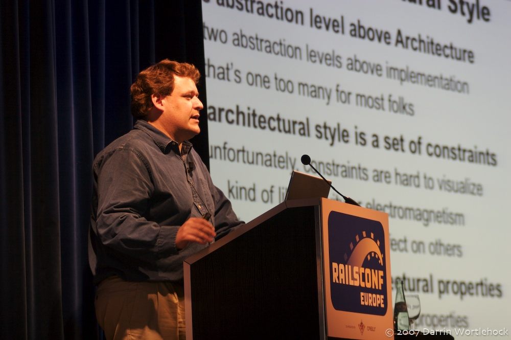
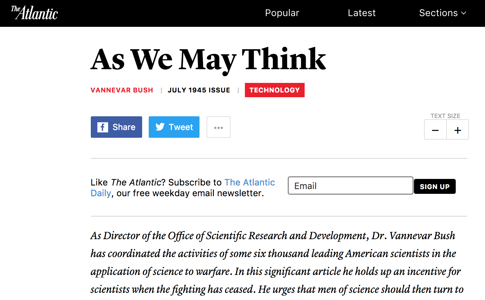
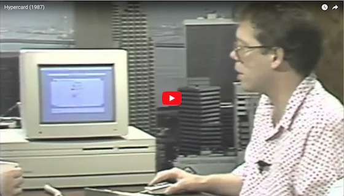
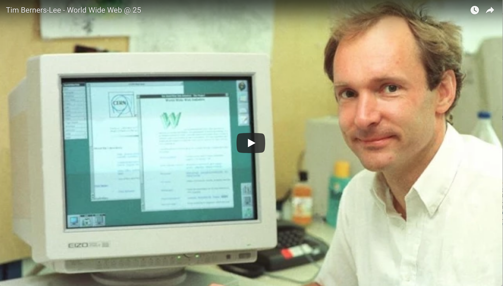

{width=70%}

<small class="rights">[Picture: Darin Wortlehock 2007, Flickr](https://www.flickr.com/photos/dwortlehock/1414515559 "Dr Roy T. Fielding | dwortlehock | Flickr") </small>

<small class="rights">
<a href="https://creativecommons.org/licenses/by-nc-sa/2.0/" class="photo-license-url" rel="license cc:license" target="_newtab">Alcuni diritti sono riservati</a></small>

---

> Hypermedia is defined by the presence of application control information embedded within, or as a layer above, the presentation of information.  [@fielding2000]

---

> Distributed hypermedia allows the presentation and control information to be stored at remote locations. [@fielding2000]

# The concept of linked information

## Vannevar Bush: Memex

---

---

> All this is conventional, except for the projection forward of present-day mechanisms and gadgetry. It affords an immediate step, however, to associative indexing, the basic idea of which is a provision whereby any item may be caused at will to select immediately and automatically another. ... The process of tying two items together is the important thing.

[As We May Think - The Atlantic](https://www.theatlantic.com/magazine/archive/1945/07/as-we-may-think/303881/)

---

## J.C.R. Licklider

> The hope is that, in not too many years, human brains and computing machines will be coupled together very tightly, and that the resulting partnership will think as no human brain has ever thought and process data in a way not approached by the information-handling machines we know today.[@licklider1960]

---

## Ted Nelson

{width=30%}

<small class="rights">Bild: Gisle Hannemyr, Wikimedia Foundation. This file is licensed under the <a href="https://en.wikipedia.org/wiki/en:Creative_Commons" class="extiw" title="w:en:Creative Commons">Creative Commons</a> <a rel="nofollow" class="external text" href="//creativecommons.org/licenses/by-sa/3.0/deed.en">Attribution-Share Alike 3.0 Unported</a> license.</small>

---

[Ted Nelson Home Page](http://xanadu.com.au/ted/ "Ted Nelson Home Page")

---

- Invention of the term “Hypertext”
- Computers used to implement hypertext
- Xanadu as a hypertext system

---

> Let me introduce the word "hypertext" to mean a body of written or pictorial material interconnected in such a complex way that it could not conveniently be presented or represented on paper. It may contain summaries, or maps of its contents and their interrelations; it may contain annotations, additions and footnotes from scholars who have examined it.[@nelson1965]

<aside class="notes">Zitat überprüfen!</aside>

---

[DigiBarn Documents: Computer Lib/Dream Machines, Ted Nelson](http://www.digibarn.com/collections/books/computer-lib/)

---

---

## Doug Engelbart 

{ width=40%}

---

[Highlights of the 1968 Demo - Doug Engelbart Institute](http://dougengelbart.org/events/1968-demo-highlights.html)

---

- Interface elements for linked information (e.g. the mouse)
- Collaborative editing
...

see: [A Lifetime Pursuit - Doug Engelbart Institute](http://www.dougengelbart.org/history/engelbart.html#5c "A Lifetime Pursuit - Doug Engelbart Institute")

---

## HyperCard

---

- Hypertext system on personal computers
- Linking of images
- Search

--- 

## HyTime

- Early standard for hypermedia systems
- Time based hypermedia 

[Cover Pages: HyTime. ISO 10744:1997 -- Hypermedia/Time-based Structuring Language (HyTime), 2nd Edition](http://xml.coverpages.org/hytime.html)

---

> What is hypermedia? Hypermedia is the union of two information processing
technologies: hypertext and multimedia. Hypertext information is accessed in more than one order. Multimedia information is communicated by more than one means.[@goldfarb1991]

---

# The WWW

---

## The invention of the web

 { width=40%}

---

<aside class="notes">Start 7:30, noch einfügen!</aside>

---

--- 

- Internet as implementation of hypertext 
- HTML as markup language for hypertext 
- URLs for addressing resources
- HTTP as protocol for universal hypermedia 

---

## Client-Server Architecture

## Early browsers

{ width=40%}

---

[File:NCSA Mosaic.PNG - Wikipedia](https://en.wikipedia.org/wiki/File:NCSA_Mosaic.PNG "File:NCSA Mosaic.PNG - Wikipedia"))

---

## The browser wars

{ width=80%}

---

## Web standards and the W3C

[World Wide Web Consortium (W3C)](https://www.w3.org/ "World Wide Web Consortium (W3C)")

[HTML Standard](https://html.spec.whatwg.org/multipage/ "HTML Standard")

---

## Native apps: Links 

[Universal Links for Developers - Apple Developer](https://developer.apple.com/ios/universal-links/)

[Handling Android App Links | Android Developers](https://developer.android.com/training/app-links/index.html)

---

## Progressive Web Apps

[Progressive Web Apps  |  Web  |  Google Developers](https://developers.google.com/web/progressive-web-apps/ "Progressive Web Apps  |  Web  |  Google Developers")

---

## RDF and the semantic web

[RDF - Semantic Web Standards](https://www.w3.org/RDF/ "RDF - Semantic Web Standards")

# Discussion

## Relevance of Open Standards

## Future of Clients

# References

## Sources

 
